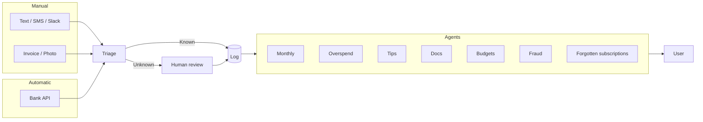

# Bloom Budget

Bloom Budget is a teen-friendly expense tracker built with Next.js. It helps users log expenses, view monthly summaries, and get playful AI-generated saving tips in a warm Asian older-sibling/auntie tone.

## Features

- simple login flow
- expense entry form with categories and description
- monthly summary with category breakdown and month-over-month comparison
- editable expense history
- AI insights and saving tips via Base44 agent prompt simulation

## Process flow



## Run locally

1. Install dependencies:
   ```bash
   npm install
   ```
2. Run development server:
   ```bash
   npm run dev
   ```

## Notes

- This version uses client-side state only and does not persist across refreshes.
- AI insights are generated from expense data in the app.
